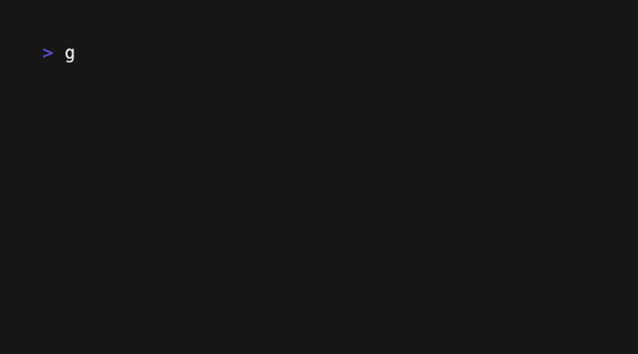

# Сервис авторизации
## Содержание
- [Описание](#desc)
- [Используемые технологии](#techs)
- [Подготовка к запуску](#installing)
- [Запуск](#running)
- [Тесты](#tests)
- [Авторы](#authors)

## Описание проекта 
Сервис авторизации

## Основные используемые технологии 
* Python 3.10 + Flask 2.2.3 + Gevent
* Postgresql (хранение данных)
* SQLAlchemy (ORM)
* Redis (кэширование)
* Gunicorn (HTTP-сервер)
* Docker (контейнеризация)

## Подготовка к запуску 
Установите <a href="https://docs.docker.com/get-docker/">docker</a>. 
 
Склонируйте репозиторий и введите переменные окружения. 
 

## Запуск 
Осуществляется командой: `make up`

## Тесты 
О тестах можно почитать здесь: [tests readme](tests/functional/README.md)

## Авторы 

* Николай Кириченко - тимлид проекта
* Салимов Гусейн aka Август - разработчик
* Гончарова Ольга - разработчик